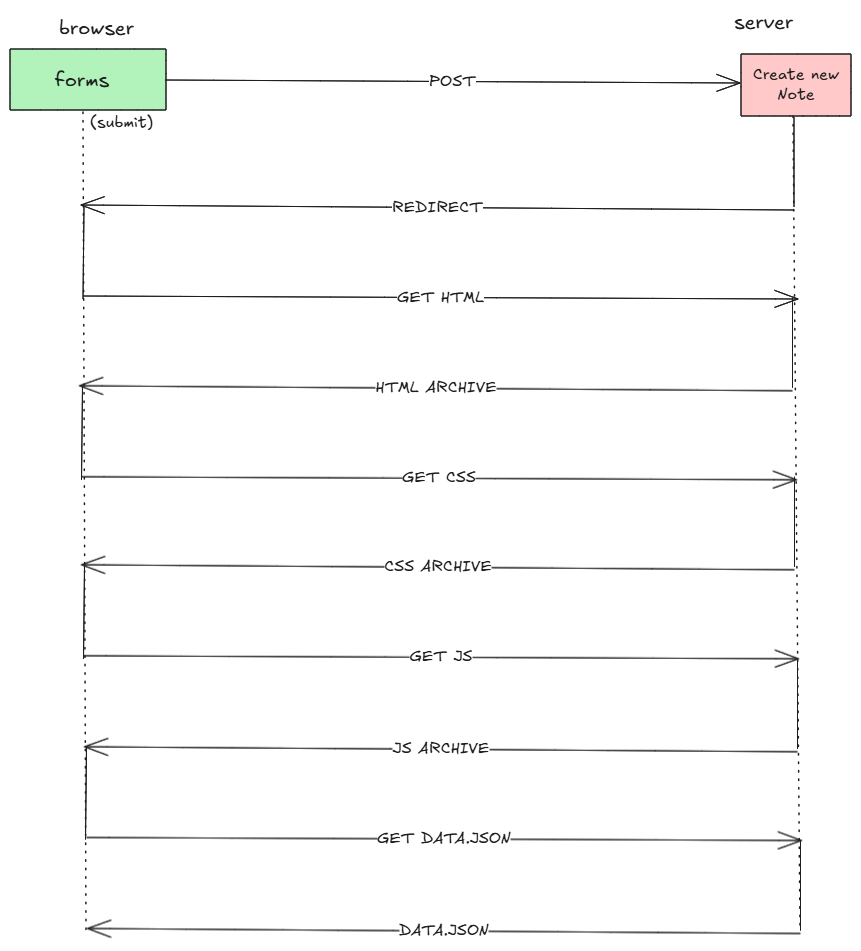

# Atividade 0.4 - Novo diagrama das notas

Crie um diagrama semelhante que retrate a situação em que o usuário cria uma nova nota na página https://studies.cs.helsinki.fi/exampleapp/notes escrevendo algo no campo de texto e clicando no botão submit.

